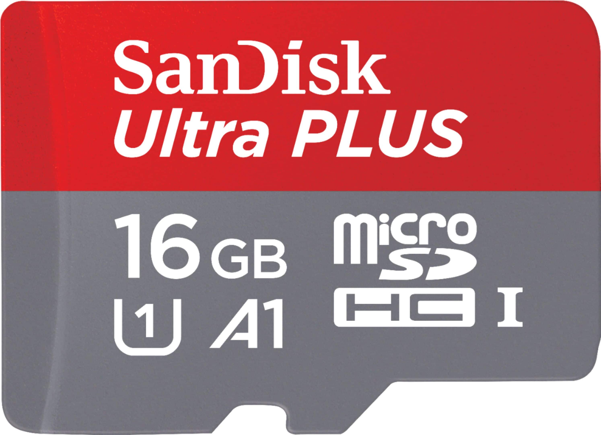

# STM32 F9P RTK Rover Logger

Low-cost STM32 + ZED-F9P rover firmware for RTK field point collection, backup UBX logging, Bluetooth NMEA pass-through, and CSV point averaging.

This project is the rover companion to the STM32 F9P base logger: [stm32_f9p_gnss_base_logger](https://github.com/jesrockr/stm32_f9p_gnss_base_logger). The base sends RTCM corrections over radio-link for `RTK FIX`; the rover receives corrected GNSS data, forwards NMEA to Android device over Bluetooth, logs raw UBX data to SD, and stores averaged points with rod-height correction.

Rover can be controlled/interfaced with using the companion [Android App](https://github.com/jesrockr/stm32_f9p_rover_Android_companion_app/)


## What It Does

- Logs the incoming ZED-F9P UART stream to SD card as `.UBX`
- Passes NMEA from the F9P through STM32 `USART3` to an HC-05 Bluetooth module
- Supports USB communication with the optional Windows Field Console (not released)
- Lets SW Maps or similar [app](https://github.com/jesrockr/stm32_f9p_rover_Android_companion_app/) receive live rover position over Bluetooth (Android only)
- Uses a momentary button to start/stop point collection
- Creates per-point UBX files such as `P001.UBX`
- Creates one CSV point file per boot session such as `POINT001.CSV`
- Averages `NAV-HPPOSLLH` position samples when available
- Falls back to `NAV-PVT` position data if high-precision messages are not enabled
- Applies rod-height correction from `ROD.TXT`
- Displays status on a 128x64 SSD1306 OLED
- Appears as a USB Storage device on Windows via STM32 usb type c port (hold button during boot)
  

## Hardware

- STM32F407ZGT6 development board
  
  
  
- u-blox ZED-F9P GNSS receiver
  
  
  
- SSD1306 128x64 I2C OLED
  
  
  
- HC-05 Bluetooth serial module
  
  
  
- SD card FAT32
  
  
  
- Momentary pushbutton

   
  
- RTK correction link, such as SiK radio

   


## Rod Height

Create `ROD.TXT` in the SD card root:

```text
2.000
```

The value is meters. On boot, the OLED reminds the user to check the configured rod height.

>Rod height correction is applied in .csv output only. If using .ubx for PPK on each point, rod height should be noted and accounted for.

If `ROD.TXT` is missing or invalid, firmware defaults to `2.000 m`.

## CSV Output

Each boot creates a new point session CSV:

```text
POINT001.CSV
POINT002.CSV
POINT003.CSV
```

Each stored point gets a matching UBX file:

```text
P001.UBX
P002.UBX
P003.UBX
```

CSV columns include:

```text
point,ubx_file,start_utc,end_utc,samples,lat_deg,lon_deg,
antenna_height_m,antenna_hmsl_m,rod_height_m,
point_height_m,point_hmsl_m,fix,carrier,sats,hacc_m,vacc_m
```

`point_height_m` and `point_hmsl_m` are corrected by subtracting rod height from the antenna position.
A stored point's coordinates are automatically averaged from all of it's readings.

## Expected OLED Flow

Boot:

```text
BOOT
UARTS OK
SDIO CFG
FATFS OK
MNT=OK SD=OK
...
CHECK ROD HEIGHT
= 2M
```

Logging:

```text
SD WRITE 55KB OK
GNSS012.UBX
LOGGING ** 00:42
SAT=18
3D        UTC=18:24:11
```

Point collection (triggered by momentary switch button):

```text
START POINT
P001.UBX
P001 12 00:12
```

Press the button again to store:

```text
STORE POINT
```

## RTK Note

The averaging and CSV storage work without RTK fix, but real survey use should require `carrier=2` RTK fixed.

Current CSV fields:

- `fix=3` means 3D GNSS fix
- `carrier=0` means no RTK carrier solution
- `carrier=1` means RTK float
- `carrier=2` means RTK fixed


## Required Tools

- STM32CubeProgrammer
- u-blox u-center


## Documentation

- [Hardware wiring](docs/HARDWARE.md)
- [F9P rover configuration](docs/F9P_ROVER_CONFIGURATION.md)
- [Build and flash](docs/BUILD_AND_FLASH.md)


